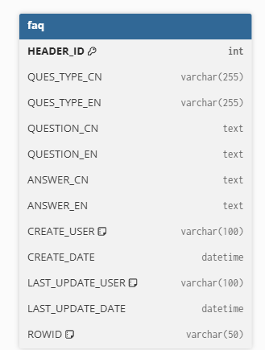
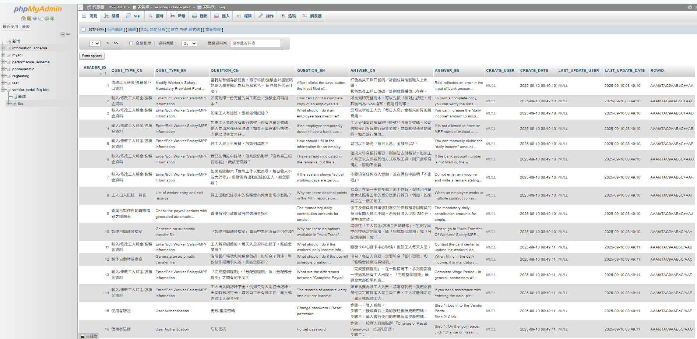
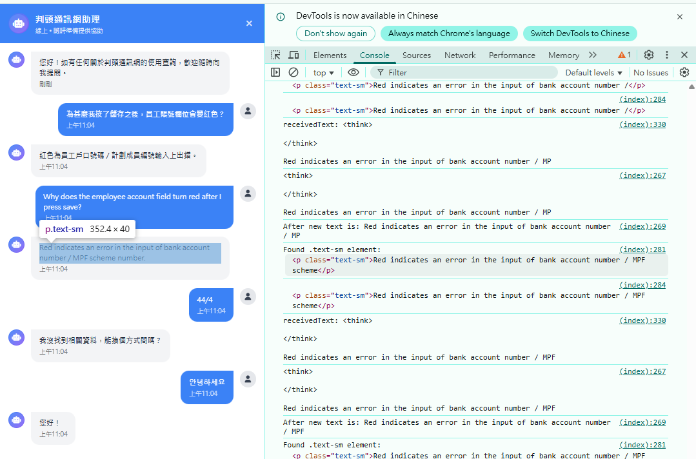
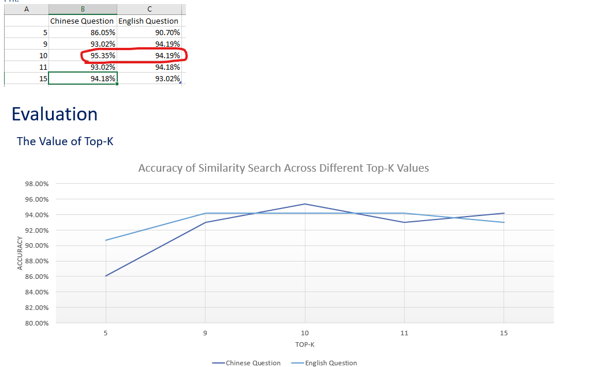

# FAQ Chatbot using Local Ollama Models

**Models:**  
- LLM model: `qwen3:32b` (Local Ollama)  
- Embedding model: `nomic-embed-text:latest` (Local Ollama)

## Setup and Usage

1. Execute `query_vector_db.py` once to create the vector database for the FAQ.  
   This will generate the `qa_faiss_index` folder in your project directory.

2. Run `app.py` to start the Flask server.  

Make sure you run these commands from the project root directory.

## How It Works (Very Brief)

Build a vector database (FAISS) from your documents →  
The chatbot searches and finds the top-k most relevant entries from the vector DB →  
The LLM uses these top-k entries as context (prompt) to generate and provide the correct answer.

## Features

- Efficiently handles large amounts of FAQ data  
- Uses fully local Ollama models (no cloud dependencies)  
- Supports multilingual FAQ with Chinese and English data

## Database Schema

## MySQL Schema

## RAG Chatbot Demo Picture

## Small Result Analysis

## Demo Video

[Watch on YouTube](https://youtube.com/shorts/f5mioYKm0f0)
